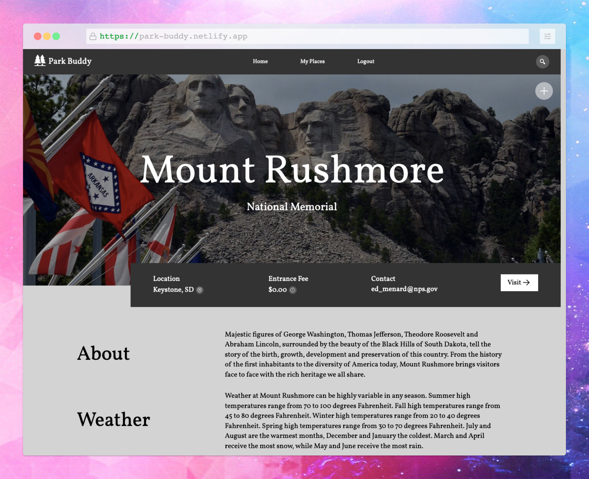
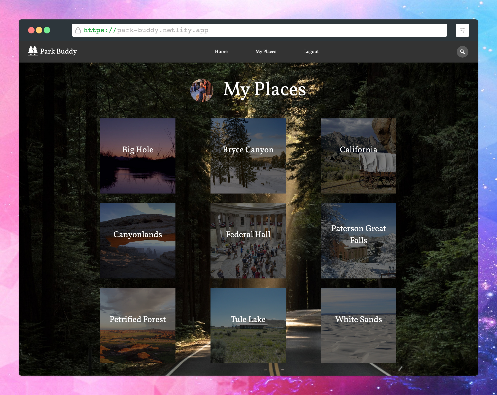

# Park Buddy

Get important information such as park details, activities, opening hours, entrance fees, and directions to national parks across the United States.




## Features

- Get relevant information about a national park in one convenient place.
- Create an account by authenticating through Github, Facebook, or Google
- With an account, save parks to your Parks page, for future reference or viewing.

## Setup

To run this application, you'll need [Git](https://git-scm.com/) and [Node.js](https://nodejs.org/) (which comes with [npm](https://www.npmjs.com/)) installed on your computer. From your command line:

```sh
# Clone this repository
$ git clone

$ cd

$ npm install

# /config/config.env
$ REACT_APP_GITHUB_CLIENT_ID=<your-github-client-id>
$ MONGO_URI=<your-mongodb-uri>
$ GITHUB_CLIENT_ID=<your-github-client-id>
$ GITHUB_CLIENT_SECRET=<your-github-client-secret>
$ FACEBOOK_CLIENT_ID=<your-facebook-client-id>
$ FACEBOOK_CLIENT_SECRET=<your-facebook-client-secret>
$ GOOGLE_CLIENT_ID=<your-google-client-id>
$ GOOGLE_CLIENT_SECRET=<your-google-client-secret>
$ COOKIE_KEY=<your-cookie-key>

```

## Tech

- [ReactJS](https://reactjs.org/) - A JavaScript library for building user interfaces
- [Redux](https://react-redux.js.org/) - for state management
- [styled components](https://styled-components.com/) - for styled components
- [node.js](http://nodejs.org) - evented I/O for the backend
- [Express](http://expressjs.com) - fast node.js network app framework
- [mongoose](https://mongoosejs.com/) - MongoDB object modeling for Node.js
- [passport.js](https://passportjs.org) - authentication middleware for Node.js

## Demo

https://park-buddy.netlify.app/

## License

MIT
